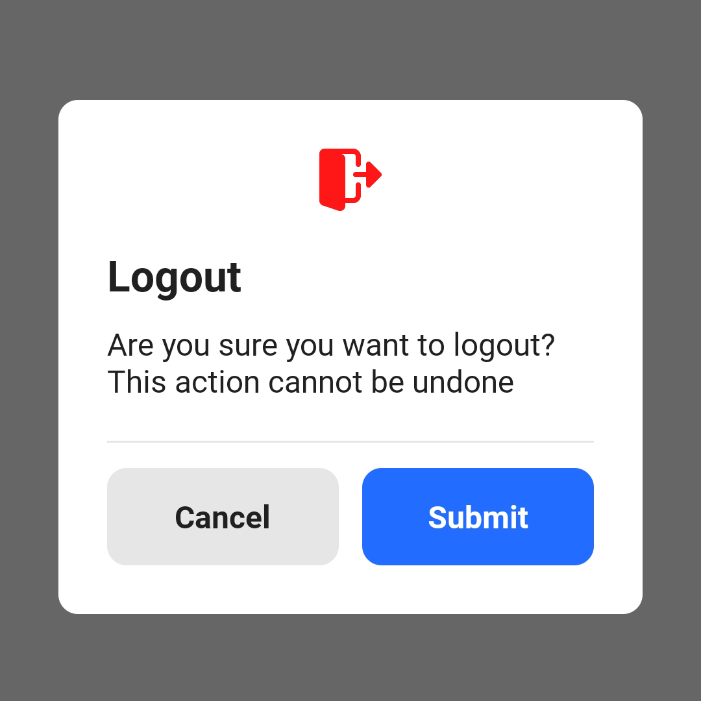
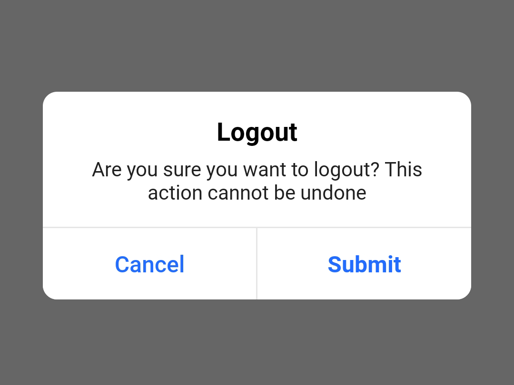
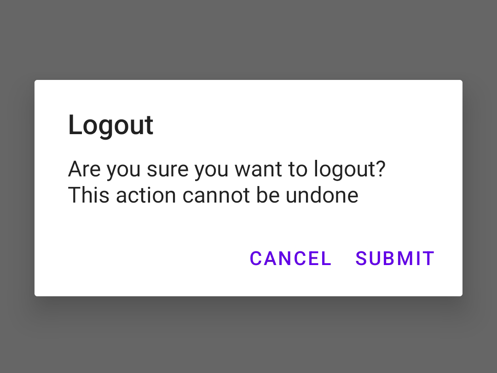

[](https://search.maven.org/search?q=g:%22com.saadahmedev.popup-dialog%22%20AND%20a:%22popup-dialog%22)
[](https://opensource.org/licenses/Apache-2.0)
<a href="https://android-arsenal.com/api?level=21"></a>

# Android Popup Dialog

Android Popup Dialog is a versatile and user-friendly Android library designed to simplify the creation of various types
of dialogs, including popups and progress dialogs. With just a few lines of code, you can effortlessly implement
different types of dialogs without the need for manual design. This library offers extensive customization options,
allowing you to tailor each dialog to suit your application's requirements.

```jql
Min SDK           : 21 - Android LOLLIPOP {5}
Max SDK           : 34 - Android UPSIDE_DOWN_CAKE {14}
Language          : Java
Compatible        : Java, Kotlin
Repository        : Maven Central
Latest Version    : 2.0.0
License           : Apache 2.0
```

Key Features
------------
* <b>Lightweight and Easy to Use:</b> Simplifies the creation of dialogs with minimal coding effort.
* <b>Versatile Dialog Types:</b> Offers a variety of dialog types, including circular progress bars, default alert
  dialogs, IOS-style popups, stylish standard dialogs, and more.
* <b>Customization Options:</b> Provides extensive customization options for every dialog type, allowing you to
  customize properties such as colors, text, animations, and more.
* <b>Written in Java:</b> Developed using Java for maximum compatibility and ease of integration.
* <b>Supports Kotlin:</b> Compatible with both Java and Kotlin programming languages.
* <b>Minimum SDK Version 21:</b> Compatible with Android Kitkat 5.0 and above.

Usage
-----
To start using Android Popup Dialog in your project, simply include the library in your dependencies and follow the provided documentation for usage instructions and examples. Enjoy hassle-free dialog creation and enhance your user experience with minimal effort.

Get Started
-----------
* Enable Data Binding feature:
```groovy
android {
    ...
    buildFeatures {
        dataBinding true
    }
}
```

* Add the dependency to your module build.gradle:

```groovy
dependencies {
    ...
    implementation 'com.saadahmedev.popup-dialog:popup-dialog:2.0.0'
}
```

Implementation
--------------

To see the Brief Implementation, please <a href="BRIEF.md">Click Here</a>

<table>
<tr>
<th> Default Progress Dialog </th>
<th> Result </th>
</tr>
<tr>
<td>

```java
PopupDialog.getInstance(context)
    .progressDialogBuilder()
    .createProgressDialog()
    .setTint(R.color.red)
    .build()
    .show();
```

</td>
<td>


</td>
</tr>
</table>

<table>
<tr>
<th> Lottie Animation Progress Dialog </th>
<th> Result </th>
</tr>
<tr>
<td>

```java
PopupDialog.getInstance(context)
    .progressDialogBuilder()
    .createLottieDialog()
    .setRawRes(R.raw.success)
    .build()
    .show();
```

</td>
<td>


</td>
</tr>
</table>

<table>
<tr>
<th> Standard Dialog </th>
<th> Result </th>
</tr>
<tr>
<td>

```java
PopupDialog.getInstance(context)
    .standardDialogBuilder()
    .createStandardDialog()
    .setHeading("Logout")
    .setDescription("Are you sure you want to logout?" +
                            " This action cannot be undone")
    .setIcon(R.drawable.ic_logout)
    .setIconColor(R.color.purple_200)
    .build(new StandardDialogActionListener() {
        @Override
        public void onPositiveButtonClicked(Dialog dialog) {
          dialog.dismiss();
        }
      
        @Override
        public void onNegativeButtonClicked(Dialog dialog) {
          dialog.dismiss();
        }
    })
    .show();
```

</td>
<td>



</td>
</tr>
</table>

<table>
<tr>
<th> IOS Dialog </th>
<th> Result </th>
</tr>
<tr>
<td>

```java
PopupDialog.getInstance(context)
    .standardDialogBuilder()
    .createIOSDialog()
    .setHeading("Logout")
    .setDescription("Are you sure you want to logout?" +
                            " This action cannot be undone")
    .build(new StandardDialogActionListener() {
        @Override
        public void onPositiveButtonClicked(Dialog dialog) {
          dialog.dismiss();
        }
      
        @Override
        public void onNegativeButtonClicked(Dialog dialog) {
          dialog.dismiss();
        }
  })
  .show();
```

</td>
<td>



</td>
</tr>
</table>

<table>
<tr>
<th> Default Alert Dialog </th>
<th> Result </th>
</tr>
<tr>
<td>

```java
PopupDialog.getInstance(context)
    .standardDialogBuilder()
    .createAlertDialog()
    .setHeading("Logout")
    .setDescription("Are you sure you want to logout?" +
                            " This action cannot be undone")
    .build(new StandardDialogActionListener() {
        @Override
        public void onPositiveButtonClicked(Dialog dialog) {
          dialog.dismiss();
        }
      
        @Override
        public void onNegativeButtonClicked(Dialog dialog) {
          dialog.dismiss();
        }
  })
  .show();
```

</td>
<td>



</td>
</tr>
</table>

<table>
<tr>
<th> Success Dialog </th>
<th> Result </th>
</tr>
<tr>
<td>

```java
PopupDialog.getInstance(context)
    .statusDialogBuilder()
    .createSuccessDialog()
    .setHeading("Well Done")
    .setDescription("You have successfully" +
        " completed the task")
    .build(Dialog::dismiss)
    .show();
```

</td>
<td>


</td>
</tr>
</table>

<table>
<tr>
<th> Warning Dialog </th>
<th> Result </th>
</tr>
<tr>
<td>

```java
PopupDialog.getInstance(context)
    .statusDialogBuilder()
    .createWarningDialog()
    .setHeading("Pending")
    .setDescription("You verification is under" +
        " observation. Try again later.")
    .build(Dialog::dismiss)
    .show();
```

</td>
<td>


</td>
</tr>
</table>

<table>
<tr>
<th> Error Dialog </th>
<th> Result </th>
</tr>
<tr>
<td>

```java
PopupDialog.getInstance(context)
    .statusDialogBuilder()
    .createErrorDialog()
    .setHeading("Uh-Oh")
    .setDescription("Unexpected error occurred." +
        " Try again later.")
    .build(Dialog::dismiss)
    .show();
```

</td>
<td>


</td>
</tr>
</table>

Changelog
---------

* **2.0.0**
  * **[MEGA UPDATE - HUGE CHANGES]**
  * Made 95.99% Customizable
  * Everything is customizable now
  * Code refactor
  * Added new structure and architecture in the library
  * Made more developer friendly
  * Improved for less coding
  * Whole class structure has been changed
  * Add lots of functions to customize in less time
  * Handled views with data using Data Binding
* **1.0.5**
  * Fixed issue "Default Dialog keeping an instance of PopupDialog always"
* **1.0.3**
  * Fixed issue "# Dialog Type 3 - Icon Animation count fix"
  * Can be used in SDK 34 also
  * Upgraded dependency versions
* **1.0.2**
  * Fixed issue "setDismissButtonBackground does not apply"
* **1.0.1**
  * Set positive and negative button text programmatically
* **1.0.0**
  * Initial release

Contribution
------------
Contributions to the Android Popup Dialog library are welcome! Whether it's bug fixes, new features, or enhancements, your contributions help make the library even better for the community. Visit the GitHub repository to contribute and collaborate with other developers.

License
-------

Android Popup Dialog is licensed under the Apache 2.0 License, allowing for both personal and commercial use. Feel free to use, modify, and distribute the library according to the terms of the license.

```
Copyright 2018-2024 Saad Ahmed

Licensed under the Apache License, Version 2.0 (the "License");
you may not use this file except in compliance with the License.
You may obtain a copy of the License at

    http://www.apache.org/licenses/LICENSE-2.0

Unless required by applicable law or agreed to in writing, software
distributed under the License is distributed on an "AS IS" BASIS,
WITHOUT WARRANTIES OR CONDITIONS OF ANY KIND, either express or implied.
See the License for the specific language governing permissions and
limitations under the License.
```